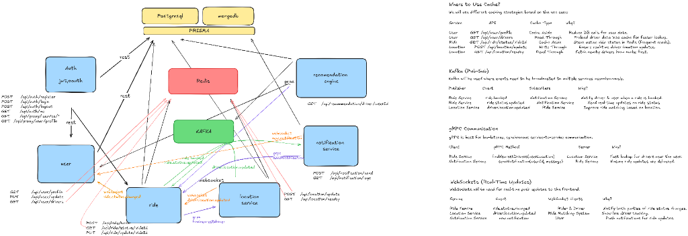

# Walkthrough - RideShare & Track Microservice

A high-scale, real-time ride-sharing and tracking platform built with a microservices architecture.

## 🗺️ System Roadmap & Architecture



## 🏗️ Architecture Overview

The system is composed of six specialized microservices and a central API Gateway, ensuring high availability and scalability.

### 1. Services & Data Management
- **API Gateway**: The central entry point that routes traffic to the appropriate microservices and handles cross-cutting concerns.
- **Auth Service**: Manages JWT-based authentication and session persistence using **Redis**.
- **User Service**: Handles rider and driver profiles with a dedicated **Postgres** instance.
- **Ride Service**: Orchestrates the ride lifecycle (booking, status changes, billing).
- **Location Service**: Powered by **PostGIS**, it handles real-time geospatial tracking and "nearest driver" lookups via **gRPC**.
- **Recommendation Engine**: A **MongoDB-backed** service that processes ride history to optimize matching and provide driver recommendations.
- **Notification Service**: Sends real-time alerts to users and drivers using **WebSockets** and **Kafka**.

## 🚀 Key Technical Features

### 📡 Real-Time Event-Driven Communication
- **Kafka**: Used for asynchronous event broadcasting. When a ride is booked, the `Ride Service` publishes an event that the `Recommendation Engine` and `Notification Service` consume.
- **WebSockets**: Provides low-latency, bi-directional communication for live driver tracking on the rider's map.

### ⚡ Performance & Scalability
- **gRPC**: Implemented for low-latency, synchronous service-to-service calls (e.g., finding the 10 nearest drivers).
- **Caching (Redis)**:
    - **Cache Aside**: Reduces database load for user profiles.
    - **Write-Through**: Ensures real-time driver locations are instantly queryable.
- **Prisma Layer**: A unified ORM layer providing typed access to both **PostgreSQL** (relational data) and **MongoDB** (unstructured ride history).

## 🛠️ Tech Stack
- **Backend**: Node.js, TypeScript, gRPC, Kafka
- **Database**: PostgreSQL (PostGIS), MongoDB, Redis
- **Infra**: Docker, API Gateway, Turborepo
- **Communication**: WebSockets (Socket.io), REST, gRPC

## 🚦 How to Run
The project is fully containerized:
```bash
cd ride-shareNtrack-microservice/backend
docker-compose --file docker-compose2.yml up -d
```
